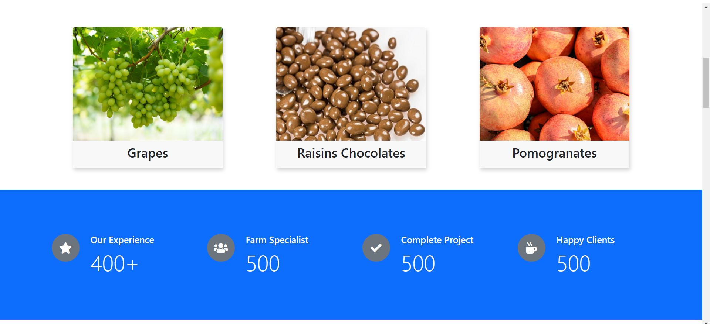
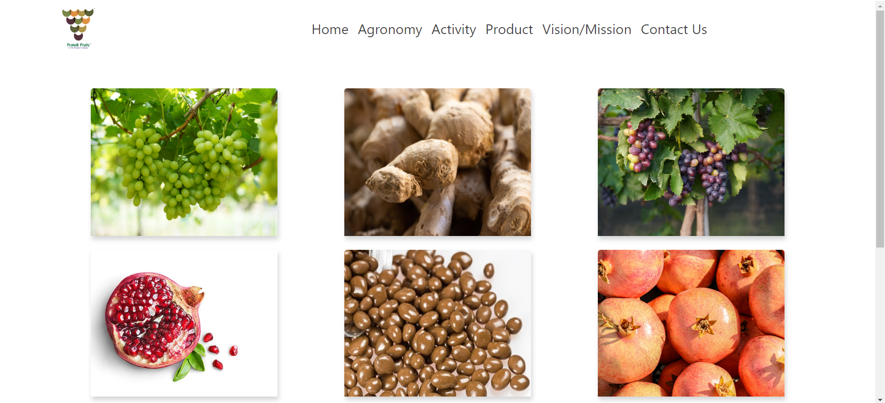
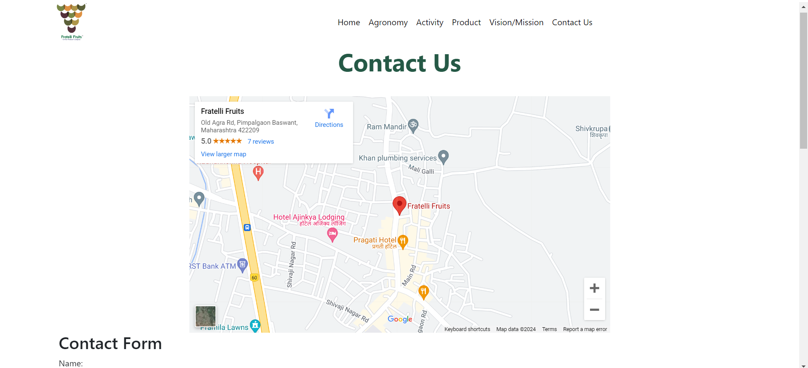

## 🔗 Hi, I'm Harshal! 👋

- [@Harshal Patil](https://github.com/GitHarshalPatil)

- 🚀React Application Developer.

## Technology Used🧑‍💻

- React
- MongoDB
- NodeJS.

## React Components⚒
- Redux
- Custom components develope
- Flatlist

## Screenshots😎

  

  

   

<!--   
  -->

## Features📓
- User Authentication – Utilizes Firebase phone authentication for secure user login.
- Product Management – Allows adding, editing, and deleting edible oil products with details like name, price, quantity, etc.
- Order Processing – Enables users to place orders for edible oils and track their order status.
- Payment Integration – Integrates with payment gateways to facilitate secure online payments.

## Functionality📝
- Manage product inventory and sales – Users can add, update, and track their edible oil products and sales within the app.
- Order tracking – Allows users to monitor the status of their orders, including processing, shipping, and delivery.
- Customer management – Provides tools for managing customer information, preferences, and purchase history.
- Sales analytics – Includes built-in analytics for monitoring sales performance, trends, and profitability.
- Integration with payment gateways – Enables secure online payments for orders through integrated payment gateways.

## Feedback
We value your feedback! Please send us your suggestions and comments at harshalpatil1847@gmail.com.

## Optimizations
- Continuous updates and improvements based on user feedback and market trends.
- Enhanced security measures to protect user data and transactions.
- Integration with additional APIs for enhanced functionality, such as real-time shipping tracking and customer support chat.
- Performance optimizations for smooth and responsive user experience across devices.
## Contributing
- Contributions are welcome! Visit our GitHub repository to learn how you can contribute to the project.